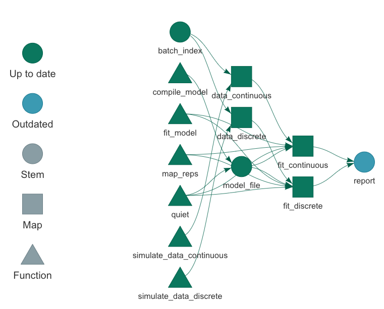

```{r, include = FALSE}
knitr::opts_chunk$set(
  collapse = TRUE,
  comment = "#>"
)
```

# `targets` R package Stan model example

[](https://rstudio.cloud/project/1430719/)

The goal of this workflow is to validate a small Bayesian model using an interval-based method similar to simulation-based calibration [SBC; @cook2006; @talts2020]. We simulate multiple datasets from the model and fit the model on each dataset. For each model fit, we determine if the 50% credible interval of the regression coefficient `beta` contains the true value of `beta` used to generate the data. If we implemented the model correctly, roughly 50% of the models should recapture the true `beta` in 50% credible intervals.

## Consider stantargets

The [`stantargets`](https://wlandau.github.io/stantargets/) R package is an extension to [`targets`](https://docs.ropensci.org/targets/) and [`cmdstanr`](https://github.com/stan-dev/cmdstanr) for Bayesian data analysis, and it makes the latter two packages easier to use together. The pipeline in this repo can be written far more concisely using the [`tar_stan_mcmc_rep_summary()`](https://wlandau.github.io/stantargets/reference/tar_stan_mcmc_rep_summary.html) function (see [this vignette](https://wlandau.github.io/stantargets/articles/mcmc_rep.html)). <https://github.com/wlandau/stantargets-example-validation> is a version of this example project that uses [`stantargets`](https://wlandau.github.io/stantargets/), and the [pipeline in the `_targets.R` file](https://github.com/wlandau/stantargets-example-validation/blob/main/_targets.R) is much simpler and easier to define.

## The model

```{r, eval = FALSE}
y_i ~ iid Normal(alpha + x_i * beta, sigma^2)
alpha ~ Normal(0, 1)
beta ~ Normal(0, 1)
sigma ~ HalfCauchy(0, 1)
```

## The `targets` pipeline

The [`targets`](https://github.com/wlandau/targets) R package manages the workflow. It automatically skips steps of the pipeline when the results are already up to date, which is critical for Bayesian data analysis because it usually takes a long time to run Markov chain Monte Carlo. It also helps users understand and communicate this work with tools like the interactive dependency graph below.


```{r, eval = FALSE}
library(targets)
tar_visnetwork()
```



## How to access

You can try out this example project as long as you have a browser and an internet connection. [Click here](https://rstudio.cloud/project/1430719/) to navigate your browser to an RStudio Cloud instance. Alternatively, you can clone or download this code repository and install the R packages [listed here](https://github.com/wlandau/targets-minimal/blob/03835c2aa4679dcf3f28c623a06d7505b18bee17/DESCRIPTION#L25-L30).

## How to run

In the R console, call the [`tar_make()`](https://wlandau.github.io/targets/reference/tar_make.html) function to run the pipeline. Then, call `tar_read(hist)` to retrieve the histogram. Experiment with [other functions](https://wlandau.github.io/targets/reference/index.html) such as [`tar_visnetwork()`](https://wlandau.github.io/targets/reference/tar_visnetwork.html) to learn how they work.

## File structure

The files in this example are organized as follows.

```{r, eval = FALSE}
├── run.sh
├── run.R
├── _targets.R
├── _targets/
├── sge.tmpl
├── R
│   ├── functions.R
│   └── utils.R
├── stan
│   └── model.stan
└── report.Rmd
```

File | Purpose
---|---
[`run.sh`](https://github.com/wlandau/targets-stan/blob/main/run.sh) | Shell script to run [`run.R`](https://github.com/wlandau/targets-stan/blob/main/run.R) in a persistent background process. Works on Unix-like systems. Helpful for long computations on servers.
[`run.R`](https://github.com/wlandau/targets-stan/blob/main/run.R) | R script to run `tar_make()` or `tar_make_clustermq()` (uncomment the function of your choice.)
[`_targets.R`](https://github.com/wlandau/targets-stan/blob/main/_targets.R) | The special R script that declares the [`targets`](https://github.com/wlandau/targets) pipeline. See `tar_script()` for details.
[`sge.tmpl`](https://github.com/wlandau/targets-stan/blob/main/sge.tmpl) | A [`clustermq`](https://github.com/mschubert/clustermq) template file to deploy targets in parallel to a Sun Grid Engine cluster. The comments in this file explain some of the choices behind the pipeline construction and arguments to `tar_target()`.
[`R/functions.R`](https://github.com/wlandau/targets-stan/blob/main/R/functions.R) | A custom R script with the most important user-defined functions.
[`R/utils.R`](https://github.com/wlandau/targets-stan/blob/main/R/utils.R) | A custom R script with helper functions.
[`stan/model.stan`](https://github.com/wlandau/targets-stan/blob/main/stan/model.stan) | The specification of our Stan model.
[`report.Rmd`](https://github.com/wlandau/targets-stan/blob/main/report.Rmd) | An R Markdown report summarizing the results of the analysis. For more information on how to include R Markdown reports as reproducible components of the pipeline, see the `tar_render()` function from the [`tarchetypes`](https://wlandau.github.io/tarchetypes) package and the [literate programming chapter of the manual](https://wlandau.github.io/targets-manual/files.html#literate-programming).

## Scaling out

This computation is currently downsized for pedagogical purposes. To scale it up, open the [`_targets.R`](https://github.com/wlandau/targets-stan/blob/main/_targets.R) script and increase the number of simulations (the number inside `seq_len()` in the `index` target).

## High-performance computing

You can run this project locally on your laptop or remotely on a cluster. You have several choices, and they each require modifications to [`run.R`](https://github.com/wlandau/targets-stan/blob/main/run.R) and [`_targets.R`](https://github.com/wlandau/targets-stan/blob/main/_targets.R).

Mode | When to use | Instructions for [`run.R`](https://github.com/wlandau/targets-stan/blob/main/run.R) | Instructions for [`_targets.R`](https://github.com/wlandau/targets-stan/blob/main/_targets.R)
---|---|---|---
Sequential | Low-spec local machine or Windows. | Uncomment `tar_make()` | No action required.
Local multicore | Local machine with a Unix-like OS. | Uncomment `tar_make_clustermq()` | Uncomment `options(clustermq.scheduler = "multicore")`
Sun Grid Engine | Sun Grid Engine cluster. | Uncomment `tar_make_clustermq()` | Uncomment `options(clustermq.scheduler = "sge", clustermq.template = "sge.tmpl")`

## References
